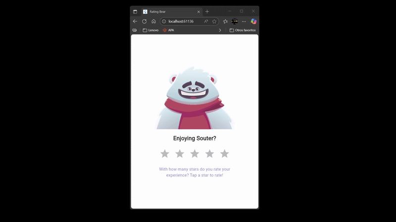

# 🧸 Rating Bear Animation – Flutter + Rive

Este proyecto muestra una animación interactiva creada en Flutter con Rive, en la que un simpático oso reacciona emocionalmente según la calificación otorgada por el usuario en una escala de 1 a 5 estrellas.
El objetivo fue reutilizar la State Machine del proyecto original (“Login Machine”) para vincular las entradas de interacción (estrellas) con dos triggers (trigSuccess y trigFail), representando los estados de felicidad y tristeza respectivamente.

---

## 🚀 Características principales

Integración completa con Rive Animation.

Control dinámico de estados mediante StateMachineController.

Reacción inmediata del oso al recibir una puntuación:

⭐ 4 o 5 estrellas → el oso se muestra feliz.

⭐ 1 o 2 estrellas → el oso se muestra triste.

Reinicio automático al estado neutral tras un breve intervalo.

Diseño responsivo, simple y centrado en la interacción emocional del usuario.

---

## 🧩 Tecnologías utilizadas

Flutter 3.x

Rive 0.13.0

Dart async y timers

Animación .riv basada en la state machine "Login Machine"

---

## ⚙️ Instalación y uso

Clona este repositorio:

```bash
git clone https://github.com/tuusuario/rating_bear.git
```

Instala las dependencias:

```bash
flutter pub get
```

Asegúrate de tener la animación en:

```bash
assets/animated_login_character.riv
```

Declara el asset en tu pubspec.yaml:

```yaml
flutter:
  assets:
    - assets/animated_login_character.riv
```

Ejecuta la app:

```bash
flutter run
```
---

📸 Vista previa


